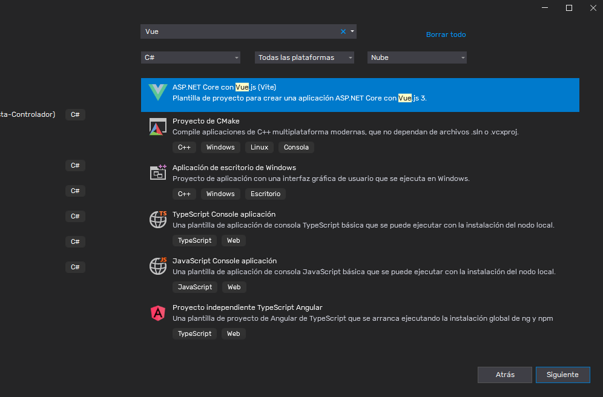
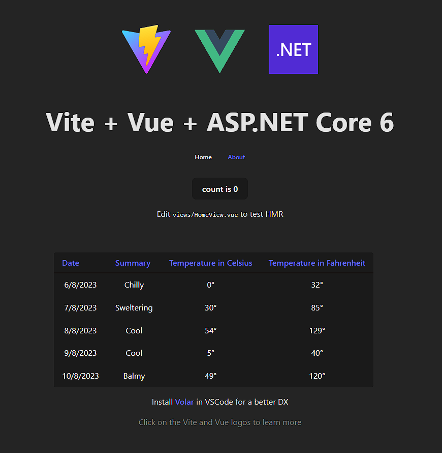

# ASP.NET Core 6 + Vite + Vue 3

Esta es una plantilla lista para iniciar proyectos en ASP.NET Core 6, utilizando como framework de front-end Vue.js acompañado de Vite como entorno de desarrollo en Visual Studio.

## ¿Como la utilizo?
Simplemente copie el archivo que se encuentra en la carpeta *"template"* a la siguiente dirección: *"C:\Users\<Username>\Documents\Visual Studio 2022\My Exported Templates"*, una vez que se encuentre en esa ubicación, sera suficiente con iniciar un nuevo proyecto desde Visual Studio y seleccionando la plantilla.

## Vistazo una vez iniciado 

---

### Esta es una primera versión, aun se encuentra en construcción 🚧.