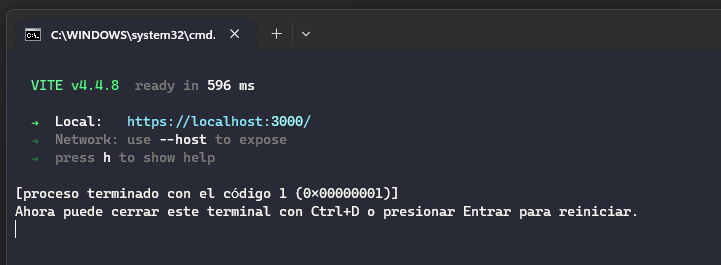
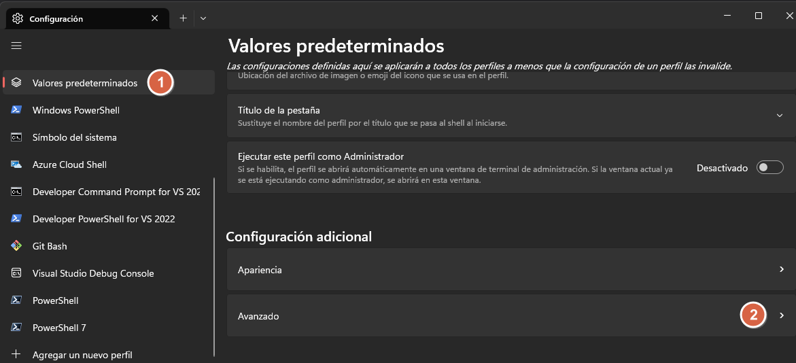
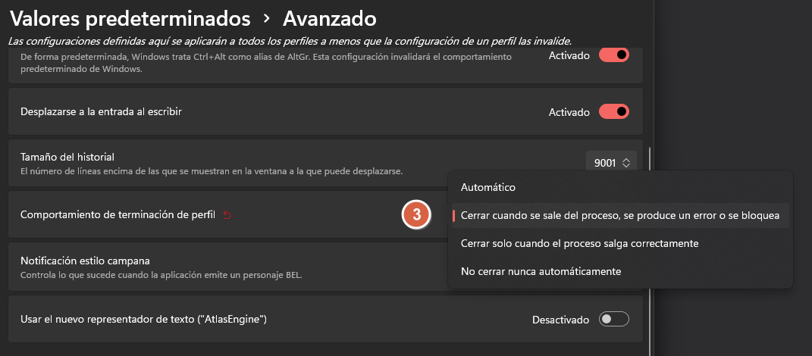

# ASP.NET Core 6 + Vite + Vue 3

Esta es una plantilla lista para iniciar proyectos en ASP.NET Core 6, utilizando como framework de front-end Vue.js acompañado de Vite como entorno de desarrollo en Visual Studio.

## ¿Como la utilizo?
Simplemente copie el archivo que se encuentra en la carpeta *"template"* a la siguiente dirección: *"C:\Users\<Username>\Documents\Visual Studio 2022\Templates\ProjectTemplates"*, una vez que se encuentre en esa ubicación, sera suficiente con iniciar un nuevo proyecto desde Visual Studio y seleccionando la plantilla.

## La terminal en windows no se cierra al dejar de debuggear mi proyecto
Si la terminal no se cierra cuando dejas de debuggear tu proyecto muestra un mensaje similar a este:

no te permite cerrarla y se van acumulando, podes hacer 2 cosas, configurarla de la siguiente manera para que se cierre cuando un proceso, en este caso Vite se cierre inesperadamente:

- En la sección configuración, seleccionar *"Valores predeterminados"(1)* para luego dirigirse a *"Configuración adicional -> Avanzado"(2)*

- Una vez dentro, buscamos el apartado *"Comportamiento de terminación de perfil"(3)*, desplegamos el combo, y seleccionamos *"Cerrar cuando se sale del proceso, se produce un error o se bloquea"*

- O también, antes de frenar la ejecución del proyecto desde Visual Studio, podes dirigirte a la instancia de la terminal que se este ejecutando en ese momento y presionar la tecla **"Q"** para frenar Vite.

## Vistazo una vez iniciado 

---

### Esta es una primera versión, aun se encuentra en construcción 🚧.